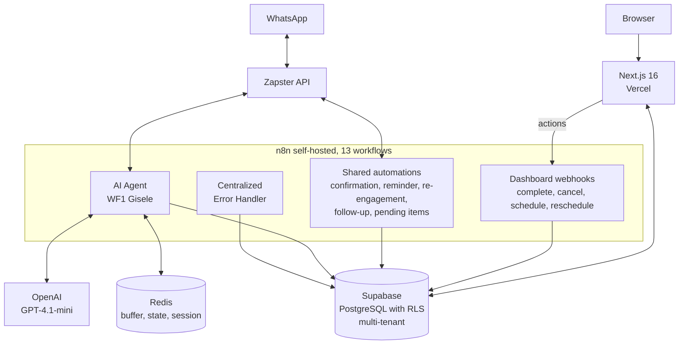

# MNS Control

> The operational platform for [Mind in Shift](https://mindinshift.com.br)'s clients.
> A multi-tenant dashboard with a services CRM, follow-up automations, appointment confirmation, service notifications, and post-service remarketing (90 days).
> The agency's clients run their day-to-day through the dashboard. The agency monitors every tenant from the SuperAdmin panel.

> 📌 This repository is a technical case study of MNS Control. The source code is closed. Here you'll find the architecture, the technical decisions, and the current state of the project.

---

## The Problem

Mind in Shift runs on two co-founders and no permanent team. I handle the technical side; Micaela handles sales and design. Every client we close gets a conversational WhatsApp agent that qualifies leads, schedules services, and fires off automated follow-ups.

It worked. But there was a catch.

The day-to-day ran on text commands. The manager of our first pilot client typed `#concluido`, `#cancelar 5512999999999`, and `#reagendar 5512999999999 15/06/2026 14:00` straight into WhatsApp. The AI agent handled the end customer, saved everything to Supabase, and I tracked things directly through the database panel and the n8n logs.

For one client, it was manageable. For two, it became impossible.

### The four concrete problems, in order of pain

1. **Commands were brittle.** Specific syntax; a typo caused a silent failure. Nothing replied, nothing confirmed, and the manager found out hours later that the appointment had never been saved.
2. **No consolidated view.** "How many appointments do I have tomorrow?" required a manual database query. There was nowhere to just look.
3. **A pending request became a lost message.** When the end customer asked to cancel or reschedule over WhatsApp, Gisele (our AI agent) recorded it, but the notification came through as just another message in the manager's WhatsApp. A message gets lost among all the others.
4. **It was impossible to scale.** Adding a second client would mean duplicating everything manually, with no isolation between operations. Every new manager would have to learn a different command syntax.

The turning point came when the agency started prospecting actively. It became clear: either I built a professional interface right then, or the operation would stall at the very first client.

---

## From WhatsApp commands to a professional dashboard

MNS Control wasn't built to replace the agent. It was built to put a human face on the same operation.

The agent still handles WhatsApp, saves to the database, and qualifies leads. The dashboard is the visual layer on top of that operation, side by side:

| Before | After |
| --- | --- |
| Manager types `#concluido` in WhatsApp and hopes for the best | Manager clicks "Complete" on the service card |
| "How many appointments tomorrow?" became a manual query | The Agenda screen shows today, tomorrow, and the next 7 days |
| A pending item arrived as a message that could slip through | A pending item opens a red card that demands action |
| Support for one client, no isolation | N clients with RLS, each seeing only their own data |

I built it in layers. The first screen was the Pipeline (a list of services with actions). Then the Agenda. Then Pending Items. Each screen shipped removed a piece of the previous fragility. When the manager stopped typing commands in WhatsApp and started using only the dashboard, that was the sign that the first half of the problem had been solved.

---

## The Solution

A multi-tenant web dashboard that consumes the same database the AI agent writes to. The modules cover the day-to-day usage contexts.

### Modules

- **Dashboard.** Per-tenant overview: active services, forecasted and realized revenue, average ticket, next appointment, weekly conversion, recent activity.
- **Pipeline.** All in-progress services with inline actions (edit, schedule, change status, view details).
- **Agenda.** Appointments organized by period, with actions to reschedule, complete, or cancel.
- **Pending Items.** Cancellations and reschedules the end customer requested over WhatsApp that still await action from the manager.
- **Leads.** Conversion funnel: new, qualifying, cold, discarded, with an action to push into the pipeline.
- **Metrics.** Full funnel, revenue by period, average ticket, top 5 services, clients by city, cancellation rate, average time to scheduling.
- **Error Center** (SuperAdmin). Errors from the n8n workflows logged automatically, with severity and a resolve action.
- **Settings.** Profile, business data, working hours, automations, user management.

### How each role uses it

**SuperAdmin** (me, in practice). I open the panel once a day, check the overall status of every tenant, resolve critical errors if any appear, and rank who's active. Five to ten minutes.

**Tenant manager.** Opens the dashboard, sees the day's pending items and appointments, checks the Pipeline for open quotes, schedules services, executes them, marks them complete, and closes out the day's pending items.

**Operator.** A role planned for growth, with no real case yet. Sees only the day's agenda in execution mode.

Access control via JWT with custom claims. SuperAdmin bypasses the tenant filter. The manager sees only their own tenant. The operator sees only their own agenda. The Next.js middleware (`proxy.ts`) redirects by role automatically.

---

## Architecture

### Layers

| Layer | Technology | Responsibility |
| --- | --- | --- |
| Frontend | Next.js 16, TypeScript, Tailwind, shadcn/ui | SSR, Server Components, Server Actions |
| Backend | Next.js (reads) and n8n (action orchestration) | No dedicated REST API; Supabase SDK called server-side |
| Database | Supabase (PostgreSQL) | Single source of truth, multi-tenant RLS, automatic triggers |
| Automation | n8n 2.17.7 self-hosted (VPS) | 13 workflows orchestrating agent, automations, and actions |
| Cache and state | Redis | Message buffer, agent-pause control, per-phone session |
| Messaging | Zapster API | Sending and receiving WhatsApp, one instance per tenant |
| AI | OpenAI GPT-4.1-mini | Engine of the conversational agent |
| Deploy | Vercel (front) and VPS (backend) | CI/CD on push to GitHub |

### Multi-tenancy

Isolation through PostgreSQL's native Row-Level Security. Each tenant has a `tenant_id` on all 8 main tables. The RLS policies use two custom functions that read from the JWT:

- `get_user_tenant_id()` returns the authenticated user's tenant.
- `get_user_role()` returns the role. SuperAdmin bypasses the tenant filter.

The practical consequence: even if someone hits the API directly with a valid token, the database blocks it at the lowest possible level. The frontend trusts that the database has already filtered. There's no need to remember to apply `where tenant_id = ?` anywhere.

### The "other side of the coin"

When I was designing the system, the first question was whether the dashboard would talk to the AI agent through an API. I decided it wouldn't. The dashboard writes straight to Supabase. So does the agent. They share a database; they don't talk to each other.

| Who acts | Where it writes | Who sees it |
| --- | --- | --- |
| End customer sends a WhatsApp message | AI agent writes to `clientes`, `atendimentos`, `leads` | Manager sees it in the dashboard in real time |
| Manager clicks "Complete" in the dashboard | n8n webhook updates `atendimentos` | End customer gets a confirmation on WhatsApp |
| PL/pgSQL trigger detects a status change | Updates `clientes.status_lead` automatically | Every interface reflects it |

This choice simplified the architecture more than I expected at first. There's no "agent API" and no "dashboard API." There's the database. And two clients that talk to it.

---

## Technical decisions

Some choices were worth debating before they became code.

### 1. When the manager clicks "Complete," the call goes to n8n, not to an internal API

When the manager finishes a service, they press a button and several things have to happen in sequence: cancel pending dispatches, create a re-engagement service 90 days later, update the client table, notify over WhatsApp. All of that orchestration already existed as a flow in n8n.

I could have replicated it in a Next.js API route. I didn't. I accepted the extra 1–2 seconds of latency and the dependency on n8n being up, in exchange for keeping the business logic in a single place.

If n8n goes down, the dashboard actions go down with it. But the dashboard's read side keeps working. It was the right trade-off.

### 2. RLS in the database, not a multi-tenant filter in the code

All isolation between clients is done through PostgreSQL policies, not a conditional in the frontend.

Security at the lowest possible level. Even if someone attacks the API directly with a valid token from another tenant, the database refuses. The frontend doesn't need to remember to filter, because there's no way to forget.

The price was harder debugging. Queries that returned empty with no visible error were the biggest source of bugs during testing (some tables were missing `INSERT` and `UPDATE` policies, and the database just stays silent when a policy doesn't match). I accepted it. I'd rather fail through RLS silence than leak data between clients.

### 3. Automatic status trigger, not logic in the frontend

When a service changes status, a PL/pgSQL function called `atualizar_status_cliente` automatically recalculates `status_lead`, `status_cliente`, `total_atendimentos`, and `valor_total_gasto` on the `clientes` table.

It guarantees consistency regardless of who updates. Dashboard, AI agent, or direct manipulation in the database all result in the same final state.

The downside is that the logic ends up "hidden" in the database. I have to remember it exists when I'm debugging strange behavior. But the consistency gain outweighs the cost of keeping it in mind.

---

## Operational results

This isn't a product conversion metric. It's an operational gain inside the agency.

### Time saved

I estimate between 8 and 12 hours per week, comparing the old operation (management by commands, direct database monitoring, manual queries) with the current one (self-service manager in the dashboard, SuperAdmin panel for me).

### Processes that used to be informal

- Every lead that arrives over WhatsApp gets an automatic record with a trackable status. Before, it lived only in the conversation.
- Qualification generates a service in the Pipeline with structured data. Before, it was free text in the chat.
- Pending items become a card with a required action. Before, it was a message that could slip through unnoticed.
- Cold-lead follow-up is automatic across four stages. Before, it was manual and forgotten.

### Production validation: Gênios Clean

First client in production. An upholstery-cleaning company in Jacareí-SP. Running MNS Control for ~3 months, with the AI agent (Gisele) integrated into the dashboard.

Cumulative numbers over the period:

- **34+ clients** registered via the AI agent, with structured data
- **10+ services** executed end to end by the manager through the dashboard
- **18+ reviews** collected automatically on Google via post-service follow-up
- **4 dispatch automations** active: confirmation 24h before the service, reminder 1h before, post-service follow-up with a review request, and automatic re-engagement 90 days later

The combination of AI agent + dashboard + automations fully replaced the previous model based on WhatsApp commands. The manager runs everything through the screen.

### Service capacity

With the old model, running more than one client in parallel wasn't viable. With MNS Control, the practical limit became my capacity to create Zapster instances and configure AI agents. A second client is in onboarding.

### Onboarding a new manager

About 30 minutes of a live demo plus a 13-page PDF manual. The system is intuitive enough to start operating right after the meeting.

---

## What I chose not to build, and why

Scope discipline is a differentiator. Resisting the temptation to add everything keeps the focus on what matters.

- **Internal chat or a WhatsApp conversation viewer.** Tempting. But it would duplicate WhatsApp in the manager's hands, since they're already using WhatsApp on their phone all the time. High effort, marginal gain.
- **Finance and billing.** The system records the service amount, but doesn't generate invoices or bank slips (boletos). Every client already has a finance tool. Mixing that in here would expand scope unnecessarily.
- **Drag-and-drop scheduling on the calendar.** The Agenda is read-only with actions through a modal (date, time, confirm). Simpler to maintain, and the flow handles it.
- **Native mobile app.** The dashboard is responsive and works in the phone's browser. A native app would carry maintenance cost with no proportional gain right now.

### What still happens outside MNS Control

- The AI agent's system prompt and FAQ are edited directly in n8n. Rarely edited, so it doesn't justify a dedicated screen for now.
- The agency's own internal finances live in a spreadsheet. It doesn't make sense to mix them with the clients' operational tool.
- Communication with the agency's clients happens over WhatsApp directly. MNS Control manages the clients' clients, not Mind in Shift's own clients.

---

## Known limitations

### Technical ones already on the plan to fix

- The `zapster_instance_id` is hardcoded per workflow. To scale without editing workflows by hand, it needs to be fetched from the `tenants` table.
- The AI agent's system prompt is fixed per workflow. It should be configurable per tenant from the database.
- Automatic notification to the end customer when they reschedule or cancel doesn't send WhatsApp yet. Today it's a deliberate choice of the pilot client, but it should be a per-tenant toggle.

### Conscious technical debt

- No automated tests. Validation was 100% manual across the cycles. Acceptable in an internal MVP; it'll be needed before scaling to more clients.
- No dedicated APM beyond the Error Center. I don't have latency, memory-usage, or throughput metrics.
- Some screens (Leads, Pending Items) still use a table with horizontal scroll on mobile instead of responsive cards.

### Scenarios where the system doesn't work well

- If n8n goes down, the dashboard actions fail silently. The frontend shows "success" before the webhook responds. It needs more robust response verification.
- A simultaneous edit conflict between two managers on the same service results in last-write-wins, with no warning.
- A high volume of simultaneous leads (above 50 messages per minute) hasn't been tested in production yet. The Redis buffer may need tuning.

---

## Roadmap (next 3 to 6 months)

- Onboarding the second client in production
- A screen to edit message templates per tenant
- Dynamic lookup of `zapster_instance_id` in the `tenants` table
- Final SVG logo (current one is a placeholder)
- Custom domain (`app.mindinshift.com.br`)
- Possible: a visual editor for the AI agent's system prompt

> MNS Control is part of the Mind in Shift service, not a product sold separately. Clients hire the agency for the AI-agent implementation plus the monthly operation, and the dashboard comes included as a management tool for their own operation.
> The multi-tenant architecture already supports licensing to other agencies if demand appears, but that would be a business decision, not a technical one.

---

## Stack

- **Frontend.** Next.js 16, TypeScript, Tailwind CSS, shadcn/ui. Navy (#0A1628) and Gold (#C9A84C) design system.
- **Backend.** Logic split between Next.js (Server Components and Server Actions for reads) and n8n 2.17.7 self-hosted (orchestration of complex actions).
- **Database.** PostgreSQL via Supabase, 8 main tables, multi-tenant RLS with custom functions (`get_user_tenant_id`, `get_user_role`), PL/pgSQL trigger `atualizar_status_cliente`.
- **Cache and state.** Redis with a key pattern of `mns:{slug}:{phone}:{type}`.
- **Automation.** n8n with 13 workflows: 1 AI agent, 6 shared automations, 5 dashboard webhooks, 1 centralized error handler.
- **Messaging.** Zapster API, one WhatsApp instance per tenant, credential via HTTP header.
- **AI.** OpenAI GPT-4.1-mini for the conversational agent.
- **Auth.** Supabase Auth with email and password, JWT with custom claims, Next.js middleware redirecting by role.
- **Hosting.** Vercel (frontend), VPS with Traefik reverse proxy (n8n, Redis, Zapster integration).
- **Observability.** Error Center fed by the n8n Error Handler. No dedicated APM yet.

---

## About

Built by [Guilherme Bosco](https://github.com/Guilherme-Bosco), co-founder of [Mind in Shift](https://mindinshift.com.br), an automation and AI agency in Jacareí-SP.

For contact about running automation agencies or technical consulting: <contato@mindinshift.com.br>, [LinkedIn](https://www.linkedin.com/in/guilherme-bosco-dos-santos-012bb620b/).
