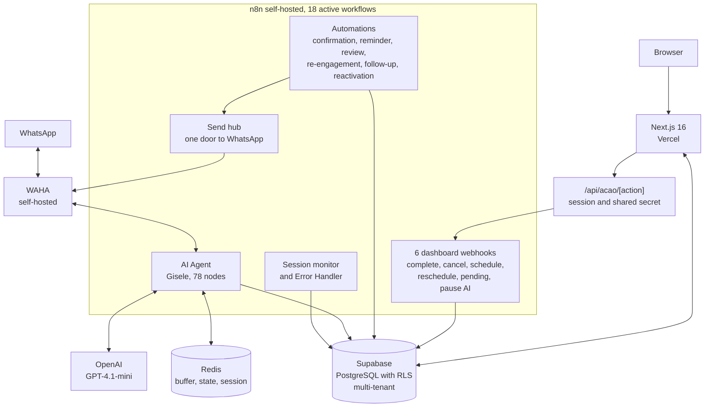

# MNS Control

> The operational platform for [Mind in Shift](https://mindinshift.com.br)'s clients.
> A multi-tenant dashboard with a services CRM, follow-up automations, appointment confirmation, service notifications, and post-service remarketing (90 days).
> The agency's clients run their day-to-day through the dashboard. The agency monitors every tenant from the SuperAdmin panel.

> 📌 This repository is a technical case study of MNS Control. The source code is closed. Here you'll find the architecture, the technical decisions, and the current state of the project.
>
> Last updated: August 19, 2026.

---

## The Problem

Mind in Shift runs on two co-founders and no permanent team. I handle the technical side; Micaela handles sales and design. Every client we close gets a conversational WhatsApp agent that qualifies leads, schedules services, and fires off automated follow-ups.

It worked. But there was a catch.

The day-to-day ran on text commands. The manager of our first pilot client typed `#concluido`, `#cancelar 5512999999999`, and `#reagendar 5512999999999 15/06/2026 14:00` straight into WhatsApp. The AI agent handled the end customer, saved everything to Supabase, and I tracked things directly through the database panel and the n8n logs.

For one client, it was manageable. For two, it became impossible.

### The four concrete problems, in order of pain

1. **Commands were brittle.** Specific syntax; a typo caused a silent failure. Nothing replied, nothing confirmed, and the manager found out hours later that the appointment had never been saved.
2. **No consolidated view.** "How many appointments do I have tomorrow?" required a manual database query. There was nowhere to just look.
3. **A pending request became a lost message.** When the end customer asked to cancel or reschedule over WhatsApp, Gisele (our AI agent) recorded it, but the notification came through as just another message in the manager's WhatsApp. A message gets lost among all the others.
4. **It was impossible to scale.** Adding a second client would mean duplicating everything manually, with no isolation between operations. Every new manager would have to learn a different command syntax.

The turning point came when the agency started prospecting actively. It became clear: either I built a professional interface right then, or the operation would stall at the very first client.

---

## From WhatsApp commands to a professional dashboard

MNS Control wasn't built to replace the agent. It was built to put a human face on the same operation.

The agent still handles WhatsApp, saves to the database, and qualifies leads. The dashboard is the visual layer on top of that operation, side by side:

| Before | After |
| --- | --- |
| Manager types `#concluido` in WhatsApp and hopes for the best | Manager clicks "Complete" on the service card |
| "How many appointments tomorrow?" became a manual query | The Agenda screen shows today, tomorrow, and the next 7 days |
| A pending item arrived as a message that could slip through | A pending item opens a card that demands a decision, and only clears once that decision is recorded |
| Support for one client, no isolation | N clients with RLS, each seeing only their own data |
| One screen for everyone | Three panels, one per role: agency, manager, field operator |

I built it in layers. The first screen was the Pipeline (a list of services with actions). Then the Agenda. Then Pending Items. Each screen shipped removed a piece of the previous fragility. When the manager stopped typing commands in WhatsApp and started using only the dashboard, that was the sign that the first half of the problem had been solved.

The second half took longer, and I'll get to it below. It's the part where the system stopped being one screen for everybody and became three surfaces, each shaped around a different person's day.

---

## The Solution

A multi-tenant web dashboard that reads from and writes to the same database the AI agent uses. It's organized into three panels, because the three people who touch this system have almost nothing in common.

### The SuperAdmin panel (the agency, which is me)

- **Overview.** The health of every tenant in one place: whether the agent is answering, stuck, or has no data at all; open errors; contract status.
- **Operations.** A queue of things that need attention, each with a reason and a severity: a WhatsApp session that dropped, a channel that was registered but never paired, an onboarding that stalled, a workflow that errored.
- **Clients.** Tenant records with a detail view in tabs: contract, channel, team, usage, onboarding.
- **Settings.** Mind in Shift's own data and internal team.

### The Manager panel (the agency's client)

- **Dashboard.** Funnel, the week's revenue, an activity feed, the next appointment.
- **Leads.** The conversion funnel as cards with filter chips and a detail drawer, plus manual entry for the leads that come in through the door instead of through WhatsApp.
- **Clients.** The tenant's base, with a chained flow that turns a lead into a client into an appointment without leaving the screen.
- **Agenda.** The day's summary, a calendar, and confirmation.
- **Pending Items.** A single decision queue: cancellations, reschedules, stalled quotes, and overdue services. Each type has its own way out (more on that below).
- **Metrics.** Funnel, comparable time windows, team productivity, peak and quiet hours.
- **Settings.** Business data, working hours, automations, and team management with per-person financial visibility.

### The Operator panel (whoever does the actual work)

This was the role that used to be "planned for growth." It isn't anymore. It was designed, built, and tested against real data.

- **Today.** Only what's assigned to them, on a phone, between one job and the next.
- **Agenda.** Theirs, not the tenant's.
- **My Leads.** What they brought in themselves.
- **Profile.** Performance, history, and account settings, behind a three-mode financial gate: no access to any figures, commission only, or full value.

Access control runs on JWT with custom claims. The middleware blocks routes by role, and a shared route like `/agenda` picks which component to render based on the role, on the server. The financial gate was validated with real data across three modes, four screens, two widths, and two themes. In "no access" mode, zero figures appear in any of the sixteen combinations.

---

## Architecture

### Layers

| Layer | Technology | Responsibility |
| --- | --- | --- |
| Frontend | Next.js 16, React 19, TypeScript, Tailwind 4, Radix | SSR, Server Components, Server Actions, two themes |
| Backend | Next.js (reads and writes) and n8n (action orchestration) | No dedicated REST API; actions with side effects go through one authenticated route |
| Database | Supabase (PostgreSQL) | Single source of truth, multi-tenant RLS, automatic triggers |
| Automation | n8n self-hosted (VPS) | 18 active workflows |
| Channel | WAHA self-hosted | WhatsApp, one session per tenant, stored in `tenant_channels` |
| Cache and state | Redis | Message buffer, agent-pause control, per-phone session |
| AI | OpenAI GPT-4.1-mini | Engine of the conversational agent |
| Deploy | Vercel (front) and VPS (backend) | CI/CD on push to GitHub |

### Multi-tenancy

Isolation through PostgreSQL's native Row-Level Security. Each tenant has a `tenant_id` on all main tables. The RLS policies use two custom functions that read from the JWT:

- `get_user_tenant_id()` returns the authenticated user's tenant.
- `get_user_role()` returns the role. SuperAdmin bypasses the tenant filter.

The practical consequence: even if someone hits the API directly with a valid token, the database blocks it at the lowest possible level. The frontend trusts that the database has already filtered. There's no need to remember to apply `where tenant_id = ?` anywhere.

### The "other side of the coin"

When I was designing the system, the first question was whether the dashboard would talk to the AI agent through an API. I decided it wouldn't. The dashboard writes straight to Supabase. So does the agent. They share a database; they don't talk to each other.

| Who acts | Where it writes | Who sees it |
| --- | --- | --- |
| End customer sends a WhatsApp message | AI agent writes to `clientes` and `atendimentos` | Manager sees it in the dashboard in real time |
| Manager clicks "Complete" in the dashboard | The dashboard route calls an n8n webhook, which updates `atendimentos` | End customer gets a confirmation on WhatsApp |
| PL/pgSQL trigger detects a status change | Updates `clientes.status_lead` automatically | Every interface reflects it |

This choice simplified the architecture more than I expected at first. There's no "agent API" and no "dashboard API." There's the database. And two clients that talk to it.

---

## Technical decisions

Some choices were worth debating before they became code.

### 1. When the manager clicks "Complete," the call goes to n8n, not to an internal API

When the manager finishes a service, they press a button and several things have to happen in sequence: cancel pending dispatches, create a re-engagement service 90 days later, update the client table, notify over WhatsApp. All of that orchestration already existed as a flow in n8n.

I could have replicated it in a Next.js API route. I didn't. I accepted the extra 1–2 seconds of latency and the dependency on n8n being up, in exchange for keeping the business logic in a single place.

If n8n goes down, the dashboard actions go down with it. But the dashboard's read side keeps working. It was the right trade-off.

### 2. Every action leaves through one door, carrying the session's identity

The browser doesn't call n8n. It calls `/api/acao/[action]` on our own server, and that route reads the `tenant_id` **from the session** before forwarding anything, with a shared secret that all six dashboard webhooks require.

The earlier version worked differently: the browser called the webhook directly and passed the tenant along in the payload. It never caused an incident, and I changed it anyway, during a security pass I ran before onboarding the second client. Identity that travels in a payload is a claim. Identity that comes from the session is a fact. Once more than one client is on the platform, that difference stops being philosophical.

The same pass tightened the database rules around role changes and cross-tenant writes, rotated a database key that two retired workflows still carried in plain text, and put the password reset flow on our own authenticated domain. None of it was visible on screen. All of it was the difference between "it works for my pilot client" and "I can sign the next contract."

### 3. RLS in the database, not a multi-tenant filter in the code

All isolation between clients is done through PostgreSQL policies, not a conditional in the frontend.

Security at the lowest possible level. Even if someone attacks the API directly with a valid token from another tenant, the database refuses. The frontend doesn't need to remember to filter, because there's no way to forget.

The price was harder debugging, and it's a specific kind of hard. **A policy that blocks a row doesn't raise an error. It hides the row.** The update then matches zero rows, and PostgreSQL cheerfully reports success. This bit me three times in one week: saving a team member "worked" and saved nothing. Every write in the system now asks for the affected id back and treats zero rows as a failure.

I'd still rather fail through RLS silence than leak data between clients. But I'd tell anyone starting out to write that zero-row check on day one, not on day three hundred.

### 4. Automatic status trigger, not logic in the frontend

When a service changes status, a PL/pgSQL function called `atualizar_status_cliente` automatically recalculates `status_lead`, `status_cliente`, `total_atendimentos`, and `valor_total_gasto` on the `clientes` table.

It guarantees consistency regardless of who updates. Dashboard, AI agent, or direct manipulation in the database all result in the same final state.

The downside is that the logic ends up "hidden" in the database. I have to remember it exists when I'm debugging strange behavior. But the consistency gain outweighs the cost of keeping it in mind.

### 5. A design system where color lives in tokens, and a test that fails the build

There are no literal colors in the codebase. Every token exists in both the dark and the light theme, and two scripts guard that: one fails if a token is defined in one theme and missing in the other, the other measures WCAG contrast and fails below 4.5:1.

The second script exists because of a bug I couldn't see. Token parity says nothing about legibility. In the light theme, the brand gold sat at 4.3:1 against the card background: unreadable, and nothing complained. The dark theme hides that class of mistake, and the dark theme is the one I stare at all day.

The same lesson showed up in a different shape. The formula for status colors had been written out by hand in 29 places across six maps, three of which shared a name without being the same thing. One got left behind during a migration, and the Agenda badges stayed washed out in the light theme with nothing to flag it. Now a screen stores the *tone*, and one file turns a tone into classes. Repetition isn't just ugly; it's where the next silent bug hides.

---

## What broke in production

This is the section that usually doesn't make it into a case study. It's the one I'd want to read.

### Two screens that were empty on purpose, and nobody noticed

The operator's "Today" and "Agenda" screens went **permanently empty**, politely saying "no services assigned to you today" while three of that day's services sat in the database.

The cause was a new column. Adding `clientes.convertido_atendimento_id` created a **second** relationship between services and clients. The embedded query that fetched the client's name and phone became ambiguous, PostgREST started refusing it, and the Supabase client returned `{ data: null }` **without throwing**. A `?? []` right after it turned that failure into an empty list. Every layer behaved exactly as written. The screen just lied.

The lesson generalizes: a new foreign key to a table you already embed will break **every** unqualified embed of that table. And a null-coalescing fallback on top of an error turns a failure into silence.

### 120 seconds per page, and it wasn't the code

Every authenticated page started taking **90 to 127 seconds**. The anonymous page answered in 75 milliseconds.

I measured and ruled out, in this order: the database (41–355ms), Supabase auth rate limiting (40 parallel calls in 171ms), IPv6, the merge that had shipped that day, and the vague suspicion that the instance was "clogged." A redeploy on its own changed nothing.

It was the serverless function's region. Moving it closer to the database brought pages back to between 0.5 and 1.8 seconds.

I'm glad I measured before I rewrote anything. Every instinct I had pointed at the code, and every one of them was wrong.

### The menu that multiplied the load by seven

The sidebar was prefetching everything. Each screen the manager opened triggered **seven full renders**, each with two round trips to the database. It's plainly visible in the logs: seven routes with a cache miss in the same second.

I turned it off, and I want to be honest about what that is. It's a trade, not a win. Prefetch exists so the next click feels instant; without it, the click costs about 0.8 seconds. The real fix is a loading skeleton, which makes prefetch cheap and the click instant at the same time. That's on the roadmap below, listed honestly as something the project doesn't have yet.

### The pause button that unpaused

"Pause AI" ran **backwards for three days** without anyone noticing. A node in the workflow was testing a field on the incoming payload, but the node feeding it had changed and its output no longer carried that field. Everything fell through the false branch. Pausing unpaused.

A button that does the opposite of what it says doesn't throw an error. Only an end-to-end test catches that, and I didn't have one at the time.

### The reminder that went to the wrong client

Two automations were pulling appointments from **every** tenant, then sending the owner notification to a tenant id that had been hardcoded to the pilot client. The result was real: two reminders about another tenant's customers landed in the wrong manager's WhatsApp.

Now the notification uses the tenant id of the appointment itself, and the daily digest groups by tenant. The send hub was already multi-tenant, so a tenant without a channel fails on its own instead of falling into someone else's inbox.

### The dispatch that said "sent" without sending

The workflows were writing `status: 'sent'` unconditionally, even when the send had failed. Which meant it was **impossible to know that a reminder hadn't gone out**, which was precisely the promise the system was supposed to keep. The status now depends on what the send hub actually returns.

---

## Operational results

This isn't a product conversion metric. It's an operational gain inside the agency.

### Production validation: Gênios Clean

First client in production. An upholstery-cleaning company in Jacareí-SP. Running MNS Control since May 16, 2026, with the AI agent (Gisele) integrated into the dashboard.

Numbers pulled from the database on August 19, 2026:

- **290 clients** in the base, **98 of them added in the last 30 days**
- **34 services** in the cycle, 19 taken end to end through the dashboard
- **546 dispatches** recorded: confirmation 24h before, reminder 1h before, post-service review request, 90-day re-engagement, cold-lead follow-up, reactivation
- **940 of 940** post-service review requests sent through the queue, none stuck

The combination of AI agent, dashboard, and automations fully replaced the previous model based on WhatsApp commands. The manager runs everything through the screen.

### Time saved

I estimate between 8 and 12 hours per week, comparing the old operation (management by commands, direct database monitoring, manual queries) with the current one (self-service manager in the dashboard, SuperAdmin panel for me).

### Processes that used to be informal

- Every lead that arrives over WhatsApp gets an automatic record with a trackable status. Before, it lived only in the conversation.
- Qualification generates a service in the Pipeline with structured data. Before, it was free text in the chat.
- Pending items become a card with a required action. Before, it was a message that could slip through unnoticed.
- Cold-lead follow-up is automatic across four stages. Before, it was manual and forgotten.

That third one deserves more than a bullet, because building it taught me something. The pending queue had zero recorded items and twenty derived ones, all of them stalled quotes, the oldest sitting there for 89 days. They were stuck because the only button on offer was "follow up on WhatsApp," and following up doesn't change any data, so the item never left the queue. A queue whose items can't exit isn't a queue. It's a list of regrets.

Now a stalled quote moves to "quote sent," and from there to "scheduled" or "declined." Scheduling updates the existing service instead of creating a new one, because creating a new one would strand the original forever. Declining deliberately skips the cancellation flow, since nobody who just said no should receive a WhatsApp message about their cancellation.

The same reasoning surfaced 19 overdue services, the oldest from June 1st, invisible until then because the Agenda lists appointments by day and nobody scrolls backwards.

### Confidence in the code

The previous version of this document said, under conscious technical debt, "no automated tests." That's no longer true.

- **464 automated tests** across 18 files, running in under two seconds
- **Two design scripts** that fail on token parity and on WCAG contrast
- The tests caught a **rule** bug, not a typo: a tenant with a registered channel that had never been paired didn't enter the attention queue at all. It would have stayed invisible indefinitely.

Tests on business rules turned out to be worth far more than tests on components. The rules are where the money and the mistakes are.

### Service capacity

With the old model, running more than one client in parallel wasn't viable. With MNS Control, the practical limit became my capacity to create WAHA sessions and configure AI agents. A second client is in onboarding.

### Onboarding a new manager

About 30 minutes of a live demo plus a 13-page PDF manual. The system is intuitive enough to start operating right after the meeting.

---

## What I chose not to build, and why

Scope discipline is a differentiator. Resisting the temptation to add everything keeps the focus on what matters.

- **Internal chat or a WhatsApp conversation viewer.** Tempting. But it would duplicate WhatsApp in the manager's hands, since they're already using WhatsApp on their phone all the time. High effort, marginal gain.
- **Finance and billing.** The system records the service amount, but doesn't generate invoices or bank slips (boletos). Every client already has a finance tool. Mixing that in here would expand scope unnecessarily.
- **Drag-and-drop scheduling on the calendar.** The Agenda is read-only with actions through a modal (date, time, confirm). Simpler to maintain, and the flow handles it.
- **Native mobile app.** The dashboard is responsive and works in the phone's browser, which is the operator's primary device anyway.
- **A button that doesn't control anything.** The "new client" wizard had a step for connecting WhatsApp by QR code. There was no server-side integration with the channel API to make it real, so the button would only have shown a toast. It got cut, along with "Reconnect" and "Generate QR" elsewhere in the panel. The rule I kept: don't ship a control that doesn't control anything. A fake button is worse than a missing one, because someone will trust it.
- **External alerting to Telegram or Slack.** The Error Center is already the place. One more channel is one more place to ignore.

### What still happens outside MNS Control

- The AI agent's system prompt and FAQ are edited directly in n8n. Rarely edited, so it doesn't justify a dedicated screen for now.
- The agency's own internal finances live in a spreadsheet. It doesn't make sense to mix them with the clients' operational tool.
- Client billing is manual, by choice. When it becomes automated, the data model has to change rather than just gain an integration: payment status needs to derive from a table of charges, one row per month, or there's no way to answer "have they been late before?"

---

## Known limitations

### Conscious technical debt

- **No loading skeletons and no error screens.** There are zero of each in the project, and that's what blocks giving the sidebar its prefetch back. It's first on the roadmap for a reason.
- **The dispatch table has two owners with opposite semantics.** One workflow treats it as a queue: read pending, send, mark sent. That one works, 940 out of 940. Two others ignore the queue, read from the source, and insert a fresh row, leaving expired pending rows behind. Until that's unified, I can't say with full confidence that one specific reminder was delivered.
- **No dedicated APM** beyond the Error Center. I don't have latency, memory-usage, or throughput metrics.

### Scenarios where the system doesn't work well

- A simultaneous edit conflict between two managers on the same service results in last-write-wins, with no warning.
- A high volume of simultaneous leads (above 50 messages per minute) hasn't been tested in production yet. The Redis buffer may need tuning.
- Time zones left residue. Some older records went in as UTC and were corrected by hand; a few with the same smell remain, flagged and deliberately untouched until someone decides what they were meant to be.

---

## Roadmap

1. Loading skeletons and error screens, which unlock giving the menu its prefetch back
2. Unify the dispatch model around the queue, so delivery is provable per reminder
3. Project documentation written for a **non-developer** to get oriented after two weeks away, because that's who reopens this project
4. Second client in production
5. Per-tenant message templates, editable from the dashboard
6. Custom domain (`app.mindinshift.com.br`)
7. Automated billing with a payment gateway, once the data model is ready for it

> MNS Control is part of the Mind in Shift service, not a product sold separately. Clients hire the agency for the AI-agent implementation plus the monthly operation, and the dashboard comes included as a management tool for their own operation.
> The multi-tenant architecture already supports licensing to other agencies if demand appears, but that would be a business decision, not a technical one.

---

## Stack

- **Frontend.** Next.js 16, React 19, TypeScript, Tailwind 4, Radix, sonner.
- **Design system.** Graphite-blue surfaces with a single desaturated gold accent, two complete themes, Sora for headings, Inter for body, JetBrains Mono for numbers and phone numbers. Token parity and WCAG contrast enforced by scripts.
- **Backend.** Server Components and Server Actions for reads and writes, one authenticated route for actions with side effects, n8n self-hosted for orchestration.
- **Database.** PostgreSQL via Supabase, multi-tenant RLS with custom functions (`get_user_tenant_id`, `get_user_role`), PL/pgSQL trigger `atualizar_status_cliente`, plus a trigger that guards role changes.
- **Cache and state.** Redis with a key pattern of `mns:{slug}:{phone}:{type}`, the prefix resolved per tenant from the database.
- **Automation.** n8n with 18 active workflows: 1 AI agent (78 nodes), 7 automations, 6 dashboard webhooks, 1 send hub, 1 session monitor, 1 centralized error handler.
- **Channel.** WAHA self-hosted, one WhatsApp session per tenant, session state polled every 5 minutes.
- **AI.** OpenAI GPT-4.1-mini for the conversational agent.
- **Auth.** Supabase Auth with email and password, JWT with custom claims, Next.js middleware redirecting by role, self-hosted password recovery on an authenticated domain (SPF, DKIM, DMARC).
- **Tests.** Vitest with 464 tests, plus two design scripts that block visual regressions.
- **Hosting.** Vercel (frontend), VPS with Traefik reverse proxy (n8n, Redis, WAHA).
- **Observability.** Error Center fed by the n8n Error Handler. No dedicated APM yet.

---

## About

Built by [Guilherme Bosco](https://github.com/Guilherme-Bosco), co-founder of [Mind in Shift](https://mindinshift.com.br), an automation and AI agency in Jacareí-SP.

For contact about running automation agencies or technical consulting: <contato@mindinshift.com.br>, [LinkedIn](https://www.linkedin.com/in/guilherme-bosco-dos-santos-012bb620b/).
