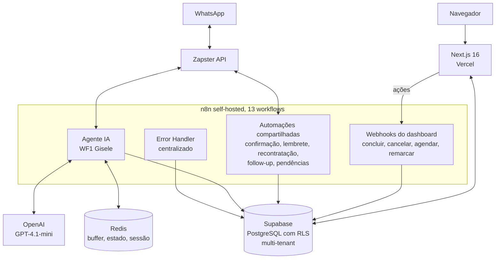

# MNS Control

> Plataforma operacional dos clientes da [Mind in Shift](https://mindinshift.com.br).
> Dashboard multi-tenant com CRM de serviços, automações de follow-up, confirmação de agendamento, notificação de serviço e remarketing pós-atendimento (90 dias).
> Os clientes da agência operam o dia a dia pelo dashboard. A agência acompanha todos os tenants pelo painel SuperAdmin.

  

> 📌 Este repositório é um case study técnico do MNS Control. O código-fonte é fechado. Aqui você encontra a arquitetura, decisões técnicas e o estado atual do projeto.

---

## O problema

A Mind in Shift opera com dois fundadores e sem time fixo. Eu cuido da parte técnica, a Micaela cuida do comercial e do design. Cada cliente que a gente fecha recebe um agente conversacional via WhatsApp que qualifica leads, agenda serviços e dispara follow-up automático.

Funcionava. Só que tinha um detalhe.

A operação do dia a dia rodava por comandos de texto. O gestor do nosso primeiro cliente piloto digitava `#concluido`, `#cancelar 5512999999999`, `#reagendar 5512999999999 15/06/2026 14:00` no próprio WhatsApp. O agente IA atendia o cliente final, gravava no Supabase, e eu acompanhava as coisas direto no painel do banco e nos logs do n8n.

Pra um cliente, dava conta. Pra dois, virava impossível.

### Os quatro problemas concretos, em ordem de dor

1. **Comandos eram frágeis.** Sintaxe específica, erro de digitação resultava em falha silenciosa. Nada respondia, nada confirmava, e o gestor descobria horas depois que o agendamento não tinha sido gravado.
2. **Sem visão consolidada.** "Quantos agendamentos eu tenho amanhã?" exigia consulta manual no banco. Não tinha onde olhar.
3. **Pendência virava mensagem perdida.** Quando o cliente final pedia cancelamento ou remarcação pelo WhatsApp, a Gisele (nosso agente IA) registrava, mas a notificação ia como mensagem solta no WhatsApp do gestor. Mensagem some no meio das outras.
4. **Era impossível escalar.** Adicionar um segundo cliente significaria duplicar tudo manualmente, sem isolamento entre operações. Cada gestor novo teria que aprender uma sintaxe diferente de comandos.

A virada veio quando a agência começou a prospectar ativamente. Ficou claro: ou eu construía uma interface profissional naquele momento, ou a operação travava no primeiro cliente.

---

## De comandos no WhatsApp ao dashboard profissional

O MNS Control não veio pra substituir o agente. Veio pra dar uma cara humana à mesma operação.

O agente continua atendendo no WhatsApp, gravando no banco, qualificando leads. O dashboard é a interface visual sobre essa operação, lado a lado:

| Antes | Depois |
|---|---|
| Gestor digita `#concluido` no WhatsApp e torce | Gestor clica em "Concluir" no card do atendimento |
| "Quantos agendamentos amanhã?" virava consulta manual | Tela de Agenda mostra hoje, amanhã, próximos 7 dias |
| Pendência chegava como mensagem que podia passar batido | Pendência abre card vermelho que exige ação |
| Suporte a um cliente, sem isolamento | N clientes com RLS, cada um vê só o que é dele |

Construí em camadas. A primeira tela foi o Pipeline (lista de atendimentos com ações). Depois Agenda. Depois Pendências. Cada tela entregue removia um pedaço da fragilidade anterior. Quando o gestor parou de digitar comandos no WhatsApp e começou a usar só o dashboard, foi o sinal de que a primeira metade do problema tinha sido resolvida.

---

## A solução

Dashboard web multi-tenant que consome a mesma base de dados que o agente IA grava. Os módulos cobrem os contextos de uso do dia a dia.

### Módulos

- **Dashboard.** Visão geral por tenant: serviços ativos, faturamento previsto e realizado, ticket médio, próximo agendamento, conversão semanal, atividade recente.
- **Pipeline.** Todos os serviços em andamento com ações inline (editar, agendar, mudar status, ver detalhes).
- **Agenda.** Agendamentos organizados por período, com ações de remarcar, concluir ou cancelar.
- **Pendências.** Cancelamentos e remarcações que o cliente final pediu pelo WhatsApp e que ainda aguardam ação do gestor.
- **Leads.** Funil de conversão: novos, qualificando, frios, descartados, com ação de enviar pro pipeline.
- **Métricas.** Funil completo, faturamento por período, ticket médio, top 5 serviços, clientes por cidade, taxa de cancelamento, tempo médio até agendamento.
- **Central de Erros** (SuperAdmin). Erros dos workflows n8n registrados automaticamente, com severidade e ação de resolver.
- **Configurações.** Perfil, dados do negócio, horários de atendimento, automações, gestão de usuários.

### Como cada papel usa

**SuperAdmin** (eu mesmo, na prática). Abro o painel uma vez por dia, vejo status geral de todos os tenants, resolvo erros críticos se aparecerem, ranqueio quem está ativo. Cinco a dez minutos.

**Gestor do tenant.** Abre o dashboard, vê pendências e agendamentos do dia, confere o Pipeline pra orçamentos pendentes, agenda serviços, executa, marca como concluído, fecha as pendências do dia.

**Operador.** Papel previsto pra crescimento, sem caso real ainda. Vê só a agenda do dia em modo execução.

Controle de acesso por JWT com claims customizados. SuperAdmin bypassa o filtro de tenant. Gestor enxerga apenas o tenant dele. Operador enxerga apenas a agenda dele. O middleware do Next.js (`proxy.ts`) redireciona por role automaticamente.

---

## Arquitetura

### Camadas

| Camada | Tecnologia | Responsabilidade |
|---|---|---|
| Frontend | Next.js 16, TypeScript, Tailwind, shadcn/ui | SSR, Server Components, Server Actions |
| Backend | Next.js (leitura) e n8n (orquestração de ações) | Sem API REST dedicada, Supabase SDK chamado server-side |
| Banco | Supabase (PostgreSQL) | Fonte única de verdade, RLS multi-tenant, triggers automáticos |
| Automação | n8n 2.17.7 self-hosted (VPS) | 13 workflows orquestrando agente, automações e ações |
| Cache e estado | Redis | Buffer de mensagens, controle de pausa do agente, sessão por telefone |
| Mensageria | Zapster API | Envio e recebimento de WhatsApp, uma instância por tenant |
| IA | OpenAI GPT-4.1-mini | Motor do agente conversacional |
| Deploy | Vercel (front) e VPS (backend) | CI/CD por push no GitHub |

### Multi-tenancy

Isolamento por Row-Level Security nativa do PostgreSQL. Cada tenant tem `tenant_id` em todas as 8 tabelas principais. As policies de RLS usam duas funções customizadas que leem do JWT:

- `get_user_tenant_id()` retorna o tenant do usuário autenticado.
- `get_user_role()` retorna o role. SuperAdmin bypassa o filtro de tenant.

A consequência prática: mesmo que alguém acesse a API direto com token válido, o banco bloqueia no nível mais baixo possível. O frontend confia que o banco já filtrou. Não precisa lembrar de aplicar `where tenant_id = ?` em lugar nenhum.

### A "outra face da moeda"

Quando eu estava desenhando o sistema, a primeira pergunta foi se o dashboard ia falar com o agente IA via API. Decidi que não. O dashboard escreve direto no Supabase. O agente também. Eles compartilham banco, não conversam entre si.

| Quem age | Onde escreve | Quem vê |
|---|---|---|
| Cliente final manda mensagem no WhatsApp | Agente IA grava em `clientes`, `atendimentos`, `leads` | Gestor vê no dashboard em tempo real |
| Gestor clica "Concluir" no dashboard | Webhook do n8n atualiza `atendimentos` | Cliente final recebe confirmação no WhatsApp |
| Trigger PL/pgSQL detecta mudança de status | Atualiza `clientes.status_lead` automaticamente | Toda interface reflete |

Essa escolha simplificou a arquitetura mais do que eu imaginava no começo. Não existe "API do agente" nem "API do dashboard". Existe o banco. E dois clientes que conversam com ele.

---

## Decisões técnicas

Algumas escolhas valeram debate antes de virar código.

### 1. Quando o gestor clica em "Concluir", a chamada vai pro n8n, não pra uma API interna

Quando o gestor termina um serviço, ele aperta um botão e várias coisas precisam acontecer em sequência: cancelar disparos pendentes, criar serviço de recontratação 90 dias depois, atualizar a tabela de cliente, notificar pelo WhatsApp. Toda essa orquestração já existia como fluxo no n8n.

Eu podia ter replicado isso numa API route do Next. Não fiz. Aceitei a latência extra de 1 ou 2 segundos e a dependência do n8n estar de pé, em troca de manter a lógica de negócio num lugar só.

Se o n8n cair, as ações do dashboard caem junto. Mas o dashboard em leitura continua funcionando. Foi a troca certa.

### 2. RLS no banco, não filtro multi-tenant no código

Todo o isolamento entre clientes é feito via policies do PostgreSQL, não via condicional no frontend.

Segurança no nível mais baixo possível. Mesmo que alguém ataque a API diretamente com token válido de outro tenant, o banco recusa. O frontend não precisa lembrar de filtrar porque não tem como esquecer.

O preço foi debugging mais difícil. Queries que retornavam vazio sem erro visível foram a maior fonte de bug durante os testes (faltavam policies de `INSERT` e `UPDATE` em algumas tabelas, e o banco só fica em silêncio quando uma policy não bate). Aceitei. Prefiro errar pelo silêncio do RLS do que vazar dado entre clientes.

### 3. Trigger automático de status, não lógica no frontend

Quando um atendimento muda de status, uma função PL/pgSQL chamada `atualizar_status_cliente` recalcula automaticamente `status_lead`, `status_cliente`, `total_atendimentos` e `valor_total_gasto` na tabela `clientes`.

Garante consistência independente de quem atualiza. Dashboard, agente IA ou manipulação direta no banco resultam todos no mesmo estado final.

A contrapartida é que a lógica fica "escondida" no banco. Eu preciso lembrar que ela existe quando vou depurar comportamento estranho. Mas o ganho de consistência supera o custo de memória.

---

## Resultados operacionais

Não é métrica de conversão de produto. É ganho operacional dentro da agência.

### Tempo economizado

Estimo entre 8 e 12 horas por semana, comparando a operação antiga (gestão por comandos, monitoramento direto no banco, consultas manuais) com a operação atual (gestor self-service no dashboard, painel SuperAdmin pra mim).

### Processos que antes eram informais

- Todo lead que chega pelo WhatsApp tem registro automático com status rastreável. Antes ficava só na conversa.
- Qualificação gera atendimento no Pipeline com dados estruturados. Antes era texto livre no chat.
- Pendências viram card com ação obrigatória. Antes era mensagem que podia passar batido.
- Follow-up de lead frio é automático em quatro estágios. Antes era manual e esquecido.

### Validação em produção: Gênios Clean

Primeiro cliente em produção. Empresa de higienização de estofados em Jacareí-SP. Operando o MNS Control há ~3 meses, com agente IA (Gisele) integrado ao dashboard.

Números acumulados no período:

- **34+ clientes** cadastrados via agente IA, com dados estruturados
- **10+ atendimentos** executados ponta a ponta pelo gestor via dashboard
- **18+ avaliações** coletadas automaticamente no Google via follow-up pós-serviço
- **4 automações** de disparo ativas: confirmação 24h antes do serviço, lembrete 1h antes, follow-up pós-serviço com solicitação de review, e recontratação automática 90 dias depois

A combinação agente IA + dashboard + automações substituiu integralmente o modelo anterior baseado em comandos via WhatsApp. O gestor opera tudo pela tela.

### Capacidade de atendimento

Com o modelo antigo, operar mais de um cliente em paralelo não era viável. Com o MNS Control, o limite prático passou a ser a capacidade de criar instâncias Zapster e configurar agentes IA. Segundo cliente em processo de onboarding.

### Onboarding de gestor novo

Cerca de 30 minutos de demonstração ao vivo mais um manual de 13 páginas em PDF. O sistema é intuitivo o suficiente pra começar a operar logo depois da reunião.

---

## O que decidi não construir, e por quê

Disciplina de escopo é diferencial. Resistir à tentação de adicionar tudo mantém o foco no que importa.

- **Chat interno ou viewer de conversas WhatsApp.** Tentador. Mas duplicaria o WhatsApp na mão do gestor, que já está usando o WhatsApp do celular o tempo todo. Esforço alto, ganho marginal.
- **Financeiro e faturamento.** O sistema registra valor do serviço, mas não gera nota fiscal nem boleto. Cada cliente já tem ferramenta financeira. Misturar isso aqui seria expandir escopo sem necessidade.
- **Agendamento drag-and-drop no calendário.** A Agenda é read-only com ações via modal (data, horário, confirma). Mais simples de manter e o fluxo dá conta.
- **App nativo mobile.** O dashboard é responsivo e funciona no navegador do celular. App nativo teria custo de manutenção sem ganho proporcional agora.

### O que ainda é feito fora do MNS Control

- O system prompt e o FAQ do agente IA são editados direto no n8n. Edição rara, não justifica tela dedicada por enquanto.
- Financeiro interno da própria agência fica em planilha. Não faz sentido misturar com a ferramenta operacional dos clientes.
- Comunicação com clientes da agência é por WhatsApp direto. O MNS Control gerencia os clientes dos clientes, não os clientes da Mind in Shift.

---

## Limitações conhecidas

### Técnicas que já estão no plano de resolver

- O `zapster_instance_id` está hardcoded por workflow. Pra escalar sem editar workflows manualmente, precisa buscar da tabela `tenants`.
- O system prompt do agente IA é fixo por workflow. Deveria ser configurável por tenant a partir do banco.
- Notificação automática ao cliente final quando remarca ou cancela ainda não envia WhatsApp. Hoje é decisão consciente do cliente piloto, mas deveria ser toggle por tenant.

### Dívida técnica consciente

- Sem testes automatizados. Validação foi 100% manual durante os ciclos. Aceitável no MVP interno, vai precisar antes de escalar pra mais clientes.
- Sem APM dedicado além da Central de Erros. Não tenho métricas de latência, uso de memória, throughput.
- Algumas telas (Leads, Pendências) ainda têm tabela com scroll horizontal no mobile em vez de cards responsivos.

### Cenários onde o sistema não funciona bem

- Se o n8n cair, as ações do dashboard falham silenciosamente. O frontend exibe "sucesso" antes da resposta do webhook. Precisa de verificação de resposta mais robusta.
- Conflito de edição simultânea entre dois gestores no mesmo atendimento resulta em last-write-wins, sem aviso.
- Volume alto de leads simultâneos (acima de 50 mensagens por minuto) ainda não foi testado em produção. O buffer Redis pode precisar de ajuste.

---

## Roadmap (próximos 3 a 6 meses)

- Onboarding do segundo cliente em produção
- Tela de edição de templates de mensagem por tenant
- Busca dinâmica do `zapster_instance_id` na tabela `tenants`
- Logo SVG definitivo (placeholder atual)
- Domínio customizado (`app.mindinshift.com.br`)
- Possível: editor visual do system prompt do agente IA

> O MNS Control é parte do serviço da Mind in Shift, não produto vendido separadamente. Os clientes contratam a agência pela implementação do agente IA mais a operação mensal, e o dashboard vem incluído como ferramenta de gestão da própria operação deles.
> A arquitetura multi-tenant já suporta licenciamento pra outras agências se aparecer demanda, mas isso seria decisão de negócio, não técnica.

---

## Stack

- **Frontend.** Next.js 16, TypeScript, Tailwind CSS, shadcn/ui. Design system Navy (#0A1628) e Gold (#C9A84C).
- **Backend.** Lógica distribuída entre Next.js (Server Components e Server Actions pra leitura) e n8n 2.17.7 self-hosted (orquestração de ações complexas).
- **Banco.** PostgreSQL via Supabase, 8 tabelas principais, RLS multi-tenant com funções customizadas (`get_user_tenant_id`, `get_user_role`), trigger PL/pgSQL `atualizar_status_cliente`.
- **Cache e estado.** Redis com padrão de keys `mns:{slug}:{phone}:{tipo}`.
- **Automação.** n8n com 13 workflows: 1 agente IA, 6 automações compartilhadas, 5 webhooks do dashboard, 1 error handler centralizado.
- **Mensageria.** Zapster API, uma instância WhatsApp por tenant, credencial via HTTP header.
- **IA.** OpenAI GPT-4.1-mini pro agente conversacional.
- **Auth.** Supabase Auth com email e senha, JWT com claims customizados, middleware Next.js redireciona por role.
- **Hosting.** Vercel (frontend), VPS com Traefik reverse proxy (n8n, Redis, integração Zapster).
- **Observabilidade.** Central de Erros alimentada pelo Error Handler do n8n. Sem APM dedicado ainda.

---

## Sobre

Construído por [Guilherme Bosco](https://github.com/Guilherme-Bosco), co-founder da [Mind in Shift](https://mindinshift.com.br), agência de automação e IA em Jacareí-SP.

Pra contato sobre operação de agências de automação ou consultoria técnica: [contato@mindinshift.com.br](mailto:contato@mindinshift.com.br), [LinkedIn](https://www.linkedin.com/in/guilherme-bosco-dos-santos-012bb620b/).
