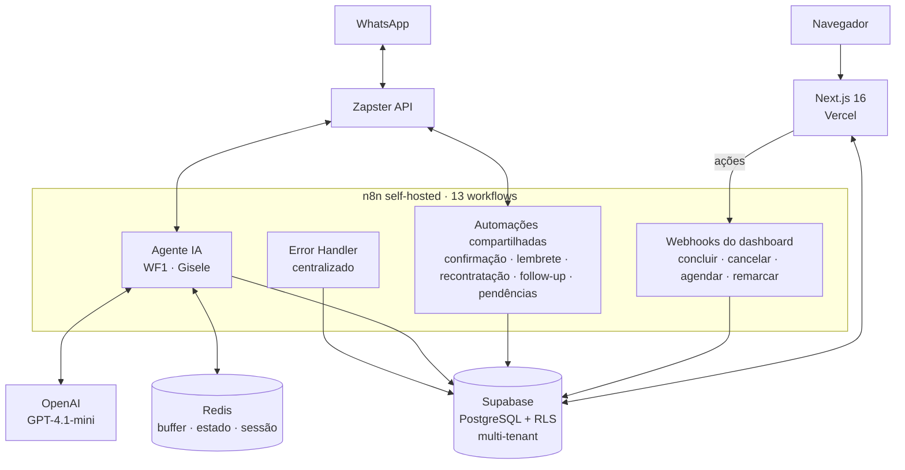

# MNS Control

> **Infraestrutura operacional interna da [Mind in Shift](https://mindinshift.com.br).**
> Dashboard multi-tenant que orquestra atendimento, agendamentos, leads e métricas dos clientes que a agência opera.
> Não é produto pra vender — é a engrenagem que faz a agência rodar.

  

> 📌 Este repositório é um **case study técnico** do MNS Control. O código-fonte é fechado. Aqui você encontra a arquitetura, decisões técnicas e estado atual do projeto.

---

## O problema (interno)

A Mind in Shift opera com modelo enxuto: 2 fundadores (técnico + comercial/design), sem colaboradores fixos. Cada cliente da agência recebe um agente conversacional (IA via WhatsApp) que qualifica leads, agenda serviços e dispara follow-ups automáticos.

**Antes do MNS Control**, a operação era fragmentada e dependia de **comandos de texto no WhatsApp**:

- O agente IA atendia o cliente final e gravava dados no Supabase
- O gestor do cliente piloto administrava a operação digitando comandos no próprio WhatsApp: `#concluido`, `#cancelar 5512999999999`, `#reagendar 5512999999999 15/06/2026 14:00`
- O time técnico monitorava diretamente o painel do Supabase e os logs do n8n

Funcionava para **um** cliente. Não escalava para **dois**.

### Os 4 problemas concretos

1. **Gestão por comandos era frágil.** Sintaxe específica, erros de digitação geravam falhas silenciosas, sem feedback claro.
2. **Sem visão consolidada.** "Quantos agendamentos tenho amanhã?" exigia consulta manual ao banco — não havia tela para olhar.
3. **Pendências se perdiam.** Cancelamentos e remarcações solicitados pelo cliente final viravam mensagem no WhatsApp do gestor — e mensagem passa.
4. **Impossível escalar.** Adicionar um segundo cliente significaria duplicar tudo manualmente, sem isolamento real entre operações.

O ponto de virada veio quando a agência começou a prospectar novos clientes ativamente: **ou se constrói uma interface profissional agora, ou a operação não escala além de um cliente**.

---

## De comandos no WhatsApp ao dashboard profissional

O MNS Control não substituiu o agente IA — ele **complementou**. O agente continua atendendo no WhatsApp, gravando no banco, qualificando leads. O dashboard é a **interface humana sobre essa mesma operação**:

| Antes | Depois |
|---|---|
| Gestor digita `#concluido` no WhatsApp e torce | Gestor clica em "Concluir" no card do atendimento |
| "Quantos agendamentos amanhã?" → consulta manual | Tela de Agenda já mostra hoje, amanhã, próximos 7 dias |
| Pendência vem como mensagem que pode passar | Pendência abre card vermelho que exige ação |
| Suporte a 1 cliente, sem isolamento | N clientes com RLS, cada um vê só o seu |

A construção foi incremental — a cada tela entregue, algo concreto na operação melhorava.

---

## A solução

Dashboard web multi-tenant que consome a mesma base de dados que o agente IA grava, organizando a operação em módulos por contexto de uso:

### Módulos

- **Dashboard** — KPIs do tenant: serviços ativos, faturamento previsto/realizado, ticket médio, próximo agendamento, conversão semanal, atividade recente
- **Pipeline** — Todos os serviços em andamento com ações inline (editar, agendar, mudar status, ver detalhes)
- **Agenda** — Agendamentos organizados por período com ações de remarcar, concluir, cancelar
- **Pendências** — Cancelamentos e remarcações solicitados pelo cliente final via WhatsApp, aguardando ação do gestor
- **Leads** — Funil de conversão: novos, qualificando, frios, descartados — com ação de enviar ao pipeline
- **Métricas** — Funil completo, faturamento por período, ticket médio, top 5 serviços, clientes por cidade, taxa de cancelamento, tempo médio até agendamento
- **Central de Erros** *(SuperAdmin)* — Erros dos workflows n8n registrados automaticamente com severidade e opção de resolver
- **Configurações** — Perfil, dados do negócio, horários de atendimento, automações, gestão de usuários

### Fluxos típicos

**Fundador (SuperAdmin), ~5–10 min/dia:**
Abre painel SuperAdmin → vê status geral de todos os tenants (agentes ativos, faturamento, erros) → resolve erros críticos se houver → entra nas configurações de tenant específico se necessário.

**Gestor do tenant:**
Abre dashboard → vê pendências e agendamentos do dia → confere Pipeline para orçamentos pendentes → agenda serviços → após executar serviço, marca como concluído → resolve pendências.

**Controle de acesso** via JWT com claims customizados: `superadmin` vê tudo, `gestor` vê só o seu tenant, `operador` vê só sua agenda do dia. Redirect automático por role no middleware.

---

## Arquitetura

### Camadas

| Camada | Tecnologia | Responsabilidade |
|---|---|---|
| Frontend | Next.js 16 + TypeScript + Tailwind + shadcn/ui | SSR, Server Components, Server Actions |
| Backend | Distribuído entre Next.js (leitura) e n8n (orquestração de ações) | Sem API REST dedicada — Supabase SDK chamado server-side |
| Banco | Supabase (PostgreSQL) | Fonte única de verdade · RLS multi-tenant · triggers automáticos |
| Automação | n8n 2.17.7 self-hosted (VPS Hostinger) | 13 workflows orquestrando agente, automações e ações |
| Cache / Estado | Redis | Buffer de mensagens, controle de pausa do agente, sessão por telefone |
| Mensageria | Zapster API | Envio e recebimento WhatsApp, uma instância por tenant |
| IA | OpenAI GPT-4.1-mini | Motor do agente conversacional |
| Deploy | Vercel (front) + VPS (backend) | CI/CD via push no GitHub |

### Multi-tenancy

Isolamento por **Row-Level Security nativa do PostgreSQL**. Cada tenant tem `tenant_id` propagado em todas as 8 tabelas principais. As policies de RLS usam duas funções customizadas que leem do JWT:

- `get_user_tenant_id()` — retorna o tenant do usuário autenticado
- `get_user_role()` — retorna o role (`superadmin` bypassa o filtro de tenant)

Resultado: mesmo que alguém acesse a API diretamente com o token, **o banco bloqueia no nível mais baixo possível**. O frontend não precisa filtrar — confia que o banco já filtrou.

### A "outra face da moeda" — agente IA e dashboard compartilhando a mesma base

O agente IA (workflow `WF1 · Gisele`) e o MNS Control **escrevem na mesma base de dados**. Não há sincronização, não há replicação, não há API intermediária — é literalmente o mesmo Supabase.

| Quem age | Onde escreve | Quem vê |
|---|---|---|
| Cliente final manda mensagem no WhatsApp | Agente IA grava em `clientes`, `atendimentos`, `leads` | Gestor vê no dashboard em tempo real |
| Gestor clica "Concluir" no dashboard | Webhook n8n atualiza `atendimentos` | Cliente final recebe confirmação no WhatsApp |
| Trigger PL/pgSQL detecta mudança de status | Atualiza `clientes.status_lead` automaticamente | Toda interface reflete |

Essa escolha simplifica drasticamente a arquitetura. **Não existe "API do agente" e "API do dashboard"** — existe **o banco**, e dois clientes que conversam com ele.

---

## Decisões técnicas

> Esta seção documenta escolhas que foram **debatidas internamente** e os trade-offs assumidos.

### 1. Webhooks n8n em vez de API routes do Next.js para ações do dashboard

**Decisão.** Quando o gestor clica "Concluir" no dashboard, o frontend chama um **webhook do n8n** em vez de uma API route interna do Next.

**Por quê.** A ação "Concluir" não é só um UPDATE no banco — ela dispara um fluxo: cancela disparos pendentes, cria novo serviço de recontratação 90 dias depois, atualiza múltiplas tabelas, notifica via WhatsApp. Toda essa orquestração já existe no n8n. Replicar no frontend duplicaria a lógica.

**Trade-off.** Adiciona latência (~1–2s) e cria dependência do n8n. Se o n8n cair, as ações do dashboard falham — mas o dashboard read-only continua funcionando. **Aceito** porque consolida a lógica de negócio em um lugar só.

### 2. RLS no banco em vez de filtro multi-tenant no código

**Decisão.** Todo o isolamento entre clientes é feito via policies do PostgreSQL, não via condicional no frontend.

**Por quê.** Segurança no nível mais baixo possível. Mesmo que alguém ataque a API diretamente com token válido de outro tenant, o banco recusa. Frontend não precisa lembrar de filtrar — não tem como esquecer.

**Trade-off.** Debugging mais difícil. Queries que retornam vazio sem erro visível quando falta policy de `INSERT` ou `UPDATE` foram a maior fonte de bugs durante os testes. **Aceito** — preferimos errar pelo silêncio do RLS do que vazar dado entre clientes.

### 3. Trigger automático de status em vez de lógica no frontend

**Decisão.** Quando um atendimento muda de status, uma função PL/pgSQL (`atualizar_status_cliente`) recalcula automaticamente `status_lead`, `status_cliente`, `total_atendimentos` e `valor_total_gasto` na tabela `clientes`.

**Por quê.** Garante consistência independente de quem atualiza — dashboard, agente IA ou manipulação direta no banco resultam no mesmo estado calculado.

**Trade-off.** Lógica de negócio "escondida" no banco (precisa lembrar que existe ao depurar). Mas o ganho de consistência supera. **Aceito**.

---

## Resultados operacionais

> Não é métrica de conversão de produto. É **ganho operacional dentro da agência**.

### Tempo economizado

**8–12 horas por semana** *(estimativa)* — entre gestão manual do cliente piloto antes do dashboard e o novo modelo self-service.

### Processos antes informais, agora formalizados

- Todo lead que chega pelo WhatsApp tem **registro automático** com status rastreável (antes ficava só na conversa)
- Qualificação gera atendimento no Pipeline com **dados estruturados** (antes era texto livre)
- Pendências de cancelamento/remarcação viram **card com ação obrigatória** (antes era mensagem que podia ser ignorada)
- Follow-up de lead frio é **automático em 4 estágios** (antes era manual e esquecido)

### Volume gerenciado pelo cliente piloto (primeiro mês de operação)

- **34+ clientes** cadastrados
- **10+ atendimentos** executados ponta a ponta
- **4 automações de disparo** ativas
- Leads entrando diariamente via agente IA

### Capacidade de atendimento

Com o modelo antigo (comandos WhatsApp), operar mais de um cliente em paralelo era inviável. Com o MNS Control, o limite prático é **a capacidade de criar instâncias Zapster e configurar agentes IA** — a infraestrutura suporta N clientes com isolamento total. Segundo cliente em processo de onboarding.

### Onboarding de gestor novo

**~30 minutos** de reunião com demonstração ao vivo + manual PDF de 13 páginas. O sistema é intuitivo o suficiente para uso imediato após apresentação.

---

## O que decidiu NÃO construir (e por quê)

> Disciplina de escopo é diferencial. Resistir à tentação de adicionar tudo
> mantém o sistema operacional e o foco no problema real.

- **Chat interno / viewer de conversas WhatsApp.** Tentador. Duplicaria o WhatsApp na mão do gestor. Esforço alto, ganho marginal.
- **Financeiro / faturamento.** O sistema registra valor do serviço, não gera nota fiscal nem boleto. Cada cliente já tem ferramenta financeira própria.
- **Agendamento drag-and-drop no calendário.** A Agenda é read-only com ações via modal. Mais simples de manter, fluxo é suficiente.
- **App nativo mobile.** Dashboard responsivo funciona no navegador do celular. App nativo teria custo de manutenção sem ganho proporcional.

### O que ainda é feito fora do MNS Control

- **System prompt e FAQ do agente IA** — editados direto no n8n. Edição rara (ajuste fino), não justifica tela dedicada por enquanto.
- **Financeiro interno da própria agência** — planilha. Não faz sentido misturar com a ferramenta operacional dos clientes.
- **Comunicação com clientes da agência** — WhatsApp direto. O MNS Control gerencia os clientes dos clientes, não os clientes da agência.

---

## Limitações conhecidas

### Técnicas planejadas para resolver

- **`zapster_instance_id` hardcoded por workflow** — precisa ser buscado da tabela `tenants` para escalar sem editar workflows manualmente.
- **System prompt fixo por workflow** — deveria ser configurável por tenant a partir do banco.
- **Notificação automática ao cliente final em remarcação/cancelamento** — hoje é decisão consciente do cliente piloto, mas deveria ser toggle por tenant.

### Dívida técnica consciente

- **Sem testes automatizados** (unitários ou e2e). Todo teste foi manual durante as baterias de validação. Aceitável no MVP interno, precisa antes de escalar para mais clientes.
- **Sem APM dedicado** além da Central de Erros. Sem métricas de latência, uso de memória.
- **Algumas telas** (Leads, Pendências) ainda têm tabela com scroll horizontal no mobile em vez de cards responsivos.

### Cenários em que não funciona bem

- **Se o n8n cair**, as ações do dashboard falham silenciosamente. O frontend exibe "sucesso" antes da resposta do webhook. Precisa de verificação de resposta mais robusta.
- **Conflito de edição simultânea** entre dois gestores no mesmo atendimento — last-write-wins sem aviso.
- **Volume alto de leads simultâneos** (>50 mensagens/minuto) não foi testado em produção. Buffer Redis pode precisar de ajuste.

---

## Roadmap (próximos 3–6 meses)

- Onboarding do segundo cliente em produção
- Tela de edição de templates de mensagem por tenant
- Buscar `zapster_instance_id` dinâmico da tabela `tenants`
- Logo SVG definitivo (placeholder atual)
- Domínio customizado (`app.mindinshift.com.br`)
- Possível: editor visual do system prompt do agente IA

> O MNS Control **não é pensado para virar SaaS**. É a infraestrutura interna que permite a agência entregar projetos de automação conversacional com qualidade e escala.
> O modelo de negócio é vender o serviço de implementação + mensalidade de operação, não licença de software. Se surgir demanda de outras agências, a arquitetura multi-tenant já suporta — mas é decisão de negócio, não técnica.

---

## Stack

- **Frontend** — Next.js 16 · TypeScript · Tailwind CSS · shadcn/ui · design system Navy (#0A1628) + Gold (#C9A84C)
- **Backend** — Next.js Server Components / Server Actions (leitura) + n8n 2.17.7 self-hosted (orquestração)
- **Banco** — PostgreSQL (Supabase) com 8 tabelas principais · RLS multi-tenant via funções customizadas (`get_user_tenant_id`, `get_user_role`) · trigger PL/pgSQL `atualizar_status_cliente`
- **Cache / Estado** — Redis · padrão de keys `mns:{slug}:{phone}:{tipo}`
- **Automação** — n8n com 13 workflows (1 agente IA + 6 automações + 5 webhooks + 1 error handler)
- **Mensageria** — Zapster API · uma instância WhatsApp por tenant
- **IA** — OpenAI GPT-4.1-mini para o agente conversacional
- **Auth** — Supabase Auth · JWT com claims customizados · middleware Next.js (`proxy.ts`) redireciona por role
- **Hosting** — Vercel (frontend) · VPS Hostinger com Traefik reverse proxy (n8n + Redis + Zapster integration)
- **Observabilidade** — Central de Erros alimentada pelo Error Handler do n8n (sem APM dedicado ainda)

---

## Sobre

Construído por [Guilherme Bosco](https://github.com/Guilherme-Bosco), co-founder da [Mind in Shift](https://mindinshift.com.br) — agência de automação e IA em Jacareí-SP.

Para contato sobre operação de agências de automação ou consultoria técnica: [contato@mindinshift.com.br](mailto:contato@mindinshift.com.br) · [LinkedIn](https://www.linkedin.com/in/guilherme-bosco-dos-santos-012bb620b/)
