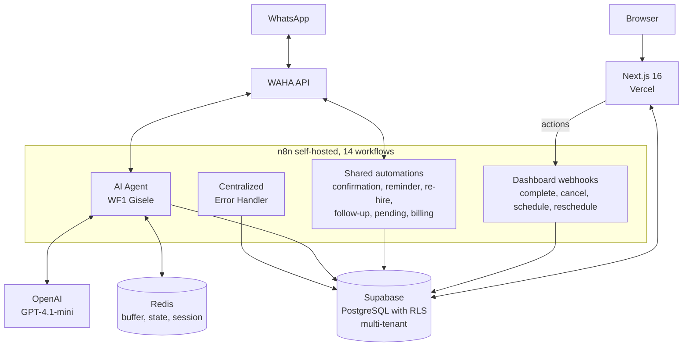

# MNS Control

[Português](./README.md) | English

> Operational platform for the clients of [Mind in Shift](https://mindinshift.com.br).
> Multi-tenant dashboard with service CRM, follow-up automations, appointment confirmation, service notifications, and 90-day post-service remarketing.
> The agency's clients run day-to-day operations through the dashboard. The agency monitors all tenants through the SuperAdmin panel.

  

> 📌 This repository is a technical case study of MNS Control. Source code is closed. Here you'll find the architecture, technical decisions, and the current state of the project.

---

## The problem

Mind in Shift runs with two founders and no fixed team. I handle the technical side, Micaela handles sales and design. Every client we close gets a WhatsApp conversational agent that qualifies leads, schedules services, and triggers automatic follow-up.

It worked. But there was a catch.

Day-to-day operations ran through text commands. The manager of our first pilot client would type `#concluido`, `#cancelar 5512999999999`, `#reagendar 5512999999999 15/06/2026 14:00` on his own WhatsApp. The AI agent handled the end customer, wrote to Supabase, and I tracked things directly through the database panel and n8n logs.

For one client, it was manageable. For two, it became impossible.

### The four concrete problems, in order of pain

1. **Commands were fragile.** Specific syntax, and a typing error would result in silent failure. Nothing responded, nothing confirmed, and the manager would find out hours later that the appointment hadn't been saved.
2. **No consolidated view.** "How many appointments do I have tomorrow?" required manual database queries. There was nowhere to look.
3. **Pending items became lost messages.** When the end customer requested cancellation or rescheduling via WhatsApp, Gisele (our AI agent) would record it, but the notification came as a loose WhatsApp message to the manager. Messages disappear in the flood.
4. **Scaling was impossible.** Adding a second client would mean manually duplicating everything, without isolation between operations. Every new manager would have to learn a different command syntax.

The turning point came when the agency started actively prospecting. It became clear: either I built a professional interface right then, or the operation would break with the first client.

---

## From WhatsApp commands to a professional dashboard

MNS Control didn't come to replace the agent. It came to give the same operation a human face.

The agent still handles WhatsApp conversations, writes to the database, and qualifies leads. The dashboard is the visual interface over that operation, side by side:

| Before | After |
|---|---|
| Manager types `#concluido` on WhatsApp and hopes for the best | Manager clicks "Complete" on the service card |
| "How many appointments tomorrow?" was a manual query | Schedule screen shows today, tomorrow, next 7 days |
| A pending item arrived as a message that could go unnoticed | A pending item opens a red card demanding action |
| One-client support, no isolation | N clients with RLS, each seeing only their own data |

I built it in layers. The first screen was the Pipeline (list of services with actions). Then Schedule. Then Pending. Each delivered screen removed a piece of the previous fragility. When the manager stopped typing commands on WhatsApp and started using only the dashboard, that was the signal that the first half of the problem had been solved.

---

## The solution

Multi-tenant web dashboard that reads from the same database the AI agent writes to. The modules cover day-to-day usage contexts.

### Modules

- **Dashboard.** Tenant overview: active services, projected and realized revenue, average ticket, next appointment, weekly conversion, recent activity.
- **Pipeline.** All ongoing services with inline actions (edit, schedule, change status, view details).
- **Schedule.** Appointments organized by time period, with actions to reschedule, complete, or cancel.
- **Pending.** Cancellations and reschedulings the end customer requested via WhatsApp that still await manager action.
- **Leads.** Conversion funnel: new, qualifying, cold, discarded, with an action to send to the pipeline.
- **Metrics.** Full funnel, revenue by period, average ticket, top 5 services, clients by city, cancellation rate, average time to appointment.
- **Error Center** (SuperAdmin). Errors from n8n workflows registered automatically, with severity and a resolve action.
- **Settings.** Profile, business data, working hours, automations, user management.

### How each role uses it

**SuperAdmin** (me, in practice). I open the panel once a day, see general status of all tenants, resolve critical errors if they appear, rank who's active. Five to ten minutes.

**Tenant manager.** Opens the dashboard, sees pending items and appointments for the day, checks the Pipeline for pending quotes, schedules services, executes them, marks as complete, closes the day's pending items.

**Operator.** A role designed for growth, no real case yet. Sees only the day's schedule in execution mode.

Access control via JWT with custom claims. SuperAdmin bypasses tenant filtering. Manager only sees their own tenant. Operator only sees their own schedule. Next.js middleware (`proxy.ts`) redirects by role automatically.

---

## Architecture

### Layers

| Layer | Technology | Responsibility |
|---|---|---|
| Frontend | Next.js 16, TypeScript, Tailwind, shadcn/ui | SSR, Server Components, Server Actions |
| Backend | Next.js (reads) and n8n (action orchestration) | No dedicated REST API, Supabase SDK called server-side |
| Database | Supabase (PostgreSQL) | Single source of truth, multi-tenant RLS, automatic triggers |
| Automation | n8n 2.17.7 self-hosted (VPS) | 14 workflows orchestrating agent, automations, and actions |
| Cache and state | Redis | Message buffer, agent pause control, session per phone |
| Messaging | WAHA API | WhatsApp send and receive, one instance per tenant |
| AI | OpenAI GPT-4.1-mini | Conversational agent engine |
| Deploy | Vercel (frontend) and VPS (backend) | CI/CD via GitHub push |

### Multi-tenancy

Isolation via PostgreSQL's native Row-Level Security. Every tenant has `tenant_id` in all 8 main tables. RLS policies use two custom functions that read from the JWT:

- `get_user_tenant_id()` returns the authenticated user's tenant.
- `get_user_role()` returns the role. SuperAdmin bypasses tenant filtering.

Practical consequence: even if someone hits the API directly with a valid token, the database blocks it at the lowest possible level. The frontend trusts that the database has already filtered. There's no need to remember to apply `where tenant_id = ?` anywhere.

### The "other side of the coin"

When I was designing the system, the first question was whether the dashboard would talk to the AI agent via API. I decided not. The dashboard writes directly to Supabase. So does the agent. They share the database, they don't talk to each other.

| Who acts | Where they write | Who sees it |
|---|---|---|
| End customer sends a WhatsApp message | AI agent writes to `clientes`, `atendimentos`, `leads` | Manager sees it on the dashboard in real time |
| Manager clicks "Complete" on the dashboard | n8n webhook updates `atendimentos` | End customer receives confirmation on WhatsApp |
| PL/pgSQL trigger detects status change | Automatically updates `clientes.status_lead` | Every interface reflects it |

This choice simplified the architecture more than I imagined at first. There's no "agent API" or "dashboard API". There's the database. And two clients that talk to it.

---

## Technical decisions

Some choices were worth debating before turning into code.

### 1. When the manager clicks "Complete", the call goes to n8n, not to an internal API

When the manager finishes a service, they press a button and several things need to happen in sequence: cancel pending dispatches, create a re-hire service 90 days later, update the client table, notify via WhatsApp. All this orchestration already existed as a flow in n8n.

I could have replicated it as a Next.js API route. I didn't. I accepted the extra 1 to 2 second latency and the dependency on n8n being up, in exchange for keeping business logic in a single place.

If n8n goes down, dashboard actions go down with it. But the dashboard in read mode keeps working. It was the right trade.

### 2. RLS in the database, not multi-tenant filtering in the code

All client isolation is done via PostgreSQL policies, not via conditionals in the frontend.

Security at the lowest possible level. Even if someone attacks the API directly with a valid token from another tenant, the database refuses. The frontend doesn't need to remember to filter because there's no way to forget.

The price was harder debugging. Queries returning empty with no visible error were the biggest source of bugs during testing (some tables were missing `INSERT` and `UPDATE` policies, and the database only stays silent when a policy doesn't match). I accepted it. I'd rather err via RLS silence than leak data between clients.

### 3. Automatic status trigger, not frontend logic

When a service changes status, a PL/pgSQL function called `atualizar_status_cliente` automatically recalculates `status_lead`, `status_cliente`, `total_atendimentos`, and `valor_total_gasto` in the `clientes` table.

It ensures consistency regardless of who's updating. Dashboard, AI agent, or direct database manipulation all result in the same final state.

The trade-off is that the logic sits "hidden" in the database. I need to remember it exists when debugging strange behavior. But the consistency gain beats the cognitive cost.

---

## Operational results

This isn't product conversion metrics. It's operational gain inside the agency.

### Time saved

I estimate between 8 and 12 hours per week, comparing the old operation (management by commands, direct database monitoring, manual queries) with the current operation (self-service manager on the dashboard, SuperAdmin panel for me).

### Processes that used to be informal

- Every lead arriving via WhatsApp has an automatic record with trackable status. It used to stay in the conversation.
- Qualification creates a Pipeline service with structured data. It used to be free text in chat.
- Pending items become cards with mandatory action. They used to be messages that could slip through.
- Cold lead follow-up is automatic across four stages. It used to be manual and forgotten.

### Production validation: Gênios Clean

First client in production. Upholstery cleaning company in Jacareí-SP, Brazil. Operating MNS Control for ~3 months, with the AI agent (Gisele) integrated to the dashboard.

Accumulated numbers over the period:

- **34+ clients** registered via AI agent, with structured data
- **10+ services** executed end-to-end by the manager through the dashboard
- **18+ reviews** automatically collected on Google via post-service follow-up
- **4 dispatch automations** active: confirmation 24h before service, reminder 1h before, post-service follow-up requesting review, and automatic re-hire 90 days later

The combination of AI agent + dashboard + automations fully replaced the previous model based on WhatsApp commands. The manager runs everything through the screen.

### Service capacity

With the old model, running more than one client in parallel wasn't viable. With MNS Control, the practical limit became the capacity to create WAHA instances and configure AI agents. Second client is being onboarded.

### New manager onboarding

Around 30 minutes of live demo plus a 13-page PDF manual. The system is intuitive enough to start operating right after the meeting.

---

## What I chose not to build, and why

Scope discipline is a differentiator. Resisting the temptation to add everything keeps focus on what matters.

- **Internal chat or WhatsApp conversation viewer.** Tempting. But it would duplicate WhatsApp in the manager's hands, when they're already using WhatsApp on their phone all the time. High effort, marginal gain.
- **Full financial and billing management.** The system has one specific automation for recurring billing via Abacate Pay (post-service webhook for the 90-day re-hire), but it doesn't generate invoices, doesn't issue one-off bills, and doesn't manage accounts payable. Every client already has dedicated financial tools, and expanding scope to become an ERP would lose product focus.
- **Drag-and-drop calendar scheduling.** The Schedule is read-only with actions via modal (date, time, confirm). Simpler to maintain and the flow handles it.
- **Native mobile app.** The dashboard is responsive and works in the phone browser. A native app would have maintenance cost without proportional gain right now.

### What still happens outside MNS Control

- The AI agent's system prompt and FAQ are edited directly in n8n. Rare edits don't justify a dedicated screen for now.
- The agency's own internal financials sit in a spreadsheet. It doesn't make sense to mix with the clients' operational tool.
- Communication with agency clients happens on WhatsApp directly. MNS Control manages the clients' clients, not Mind in Shift's clients.

---

## Known limitations

### Technical issues already in the resolution plan

- The `waha_instance_id` is hardcoded per workflow. To scale without manually editing workflows, it needs to be fetched from the `tenants` table.
- The AI agent's system prompt is fixed per workflow. It should be configurable per tenant from the database.
- Automatic end-customer notification when rescheduling or canceling doesn't send WhatsApp yet. Today it's a conscious pilot-client decision, but it should be a per-tenant toggle.

### Conscious technical debt

- No automated tests. Validation was 100% manual during cycles. Acceptable for an internal MVP, will be needed before scaling to more clients.
- No dedicated APM beyond the Error Center. I have no latency, memory usage, or throughput metrics.
- Some screens (Leads, Pending) still have tables with horizontal scroll on mobile instead of responsive cards.

### Scenarios where the system doesn't work well

- If n8n goes down, dashboard actions fail silently. The frontend shows "success" before the webhook responds. Needs more robust response verification.
- Simultaneous edit conflict between two managers on the same service results in last-write-wins, without warning.
- High simultaneous lead volume (above 50 messages per minute) hasn't been tested in production yet. The Redis buffer might need tuning.

---

## Roadmap (next 3 to 6 months)

- Onboarding of the second client into production
- Message template editor per tenant
- Dynamic lookup of `waha_instance_id` from the `tenants` table
- Final SVG logo (current is placeholder)
- Custom domain (`app.mindinshift.com.br`)
- Possibly: visual editor of the AI agent's system prompt

Recurring billing automation via Abacate Pay was recently incorporated as an additional workflow inside the 90-day re-hire flow. It's not a product focus and stays as a background automation, without its own interface in the dashboard.

> MNS Control is part of Mind in Shift's service offering, not a product sold separately. Clients hire the agency for AI agent implementation plus monthly operations, and the dashboard comes included as a tool to manage their own operations.
> The multi-tenant architecture already supports licensing to other agencies if demand emerges, but that would be a business decision, not a technical one.

---

## Stack

- **Frontend.** Next.js 16, TypeScript, Tailwind CSS, shadcn/ui. Design system Navy (#0A1628) and Gold (#C9A84C).
- **Backend.** Logic distributed between Next.js (Server Components and Server Actions for reads) and n8n 2.17.7 self-hosted (complex action orchestration).
- **Database.** PostgreSQL via Supabase, 8 main tables, multi-tenant RLS with custom functions (`get_user_tenant_id`, `get_user_role`), PL/pgSQL trigger `atualizar_status_cliente`.
- **Cache and state.** Redis with key pattern `mns:{slug}:{phone}:{type}`.
- **Automation.** n8n with 14 workflows: 1 AI agent, 7 shared automations (including recurring billing via Abacate Pay), 5 dashboard webhooks, 1 centralized error handler.
- **Messaging.** WAHA API self-hosted, one WhatsApp instance per tenant, credential via HTTP header.
- **Payments.** Abacate Pay via webhook. Recurring billing automation triggered in the post-service flow, integrated with the 90-day re-hire cycle.
- **AI.** OpenAI GPT-4.1-mini for the conversational agent.
- **Auth.** Supabase Auth with email and password, JWT with custom claims, Next.js middleware redirects by role.
- **Hosting.** Vercel (frontend), VPS with Traefik reverse proxy (n8n, Redis, WAHA).
- **Observability.** Error Center fed by n8n's Error Handler. No dedicated APM yet.

---

## About

Built by [Guilherme Bosco](https://github.com/Guilherme-Bosco), co-founder of [Mind in Shift](https://mindinshift.com.br), an automation and AI agency in Jacareí-SP, Brazil.

For inquiries about running automation agencies or technical consulting: <contato@mindinshift.com.br>, [LinkedIn](https://www.linkedin.com/in/guilherme-bosco-dos-santos-012bb620b/).
